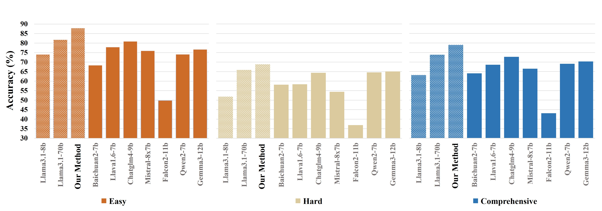
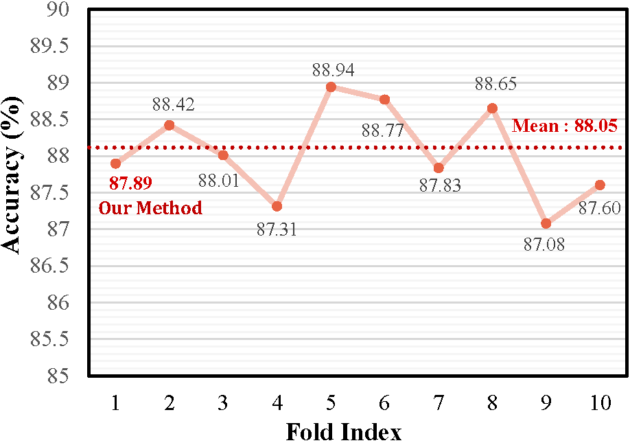
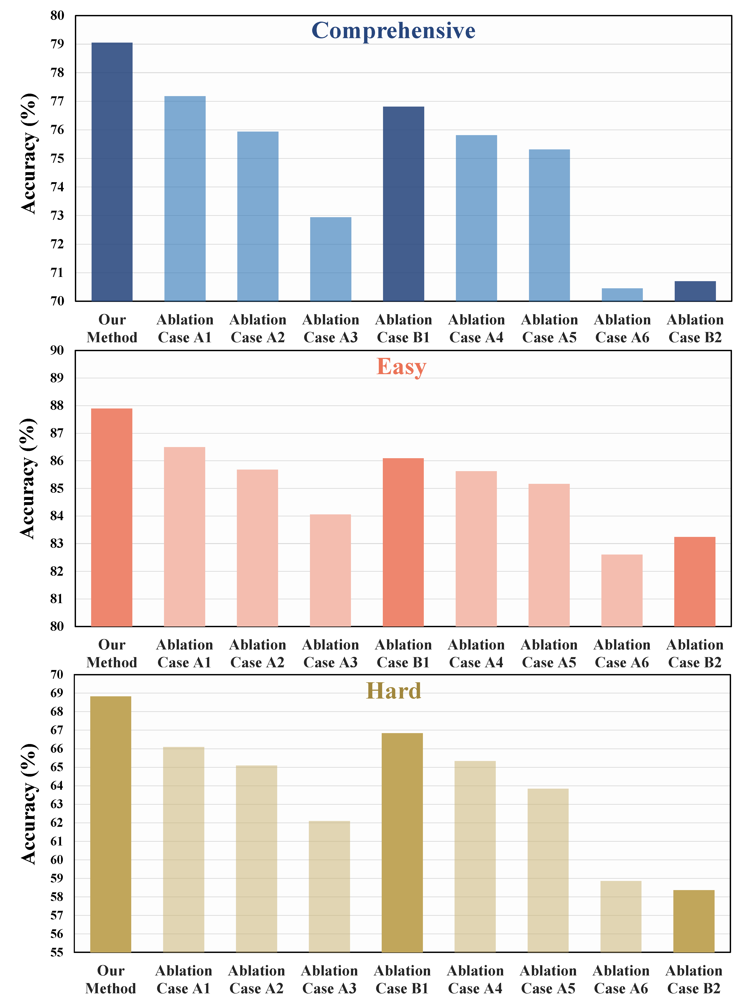

# Rephrase and Contrast Fine-tuning

This repository contains the dataset and associated fine-tuning implementation proposed in paper **[LLM Fine-Tuning for Enhanced Network
Understanding: A Rephrase and Contrast Approach](./manuscript/Rephrase_and_Contrast_IEEE_Network.pdf)**. In this paper we propose a concise framework for fine-tuning language models on the RaC dataset, with end-to-end support for data preparation, training and evaluation.

**Note: This paper is still under review. We will open-source the data once it is accepted.**

---

## Table of Contents

- [Rephrase and Contrast Fine-tuning](#rephrase-and-contrast-fine-tuning)
  - [Table of Contents](#table-of-contents)
  - [Repository Structure](#repository-structure)
  - [Environment Setup](#environment-setup)
  - [Data Processing](#data-processing)
  - [Training](#training)
  - [Evaluation](#evaluation)
  - [Results](#results)
  - [](#)
  - [Contact](#contact)

---

## Repository Structure

```
.
├── figures/
├── llama3.1-8b/               # Model-specific scripts and datasets
│   ├── 8B/                    # LLaMA3.1-8B base model
│   ├── RaC-Lora/              # Our fine-tuned model's LoRA adapters
│   ├── get_prompt.py          # Inference script
│   ├── get_analyse.py         # Accuracy analysis script
│   └── RaC-Datasets/          # Generated 10-fold splits
│       ├── balance.py             # Balance original dataset
│       ├── kfold.py               # Create 10-fold splits
│       ├── augment-x4.py          # 4× data augmentation
│       └── augment-x24.py         # 24× data augmentation
├── llama-recipes/             # Training scripts and recipes
│   ├── preprocess_data/       # Data preprocessing scripts
│   ├── train_eval_chatbot.sh
│   ├── train_eval_chatbot_kfold.sh
│   └── train_eval_chatbot_ablation.sh
├── manuscript/                # Paper source files
└── README.md
```

---

## Environment Setup
- Pre-requisite: Pytorch
```
git clone https://github.com/1155157110/RaC_open_dataset.git
cd RaC
pip install transformers peft openpyxl
cd llama-recipes
pip install -e .
```

## Data Processing

1. **Balance original data**

   ```bash
   python balance.py \
     --input Datasets_17k.csv \
     --output Datasets_17k_balanced.csv
   ```

2. **10-fold split**

   ```bash
   python kfold.py
   ```

   This creates:

   * `test/` – 10 test-fold files
   * `train/` – three subfolders:

     * `balanced_train_split/`

     * `augmented_x4_train_split/`

     * `augmented_x24_train_split/`

   > **Note:** Only `balanced_train_split/` is committed to this repo.

3. **Generate augmented sets**

   * **24× augmentation**:

     ```bash
     python augment-x24.py 0
     ```
   * **4× augmentation**:

     ```bash
     python augment-x4.py 0
     ```

---

## Training

All training recipes live in **`llama-recipes/`**:

* **Standard training**

  ```bash
  bash llama-recipes/train_eval_chatbot.sh
  ```
* **K-fold cross-validation**

  ```bash
  bash llama-recipes/train_eval_chatbot_kfold.sh
  ```
* **Ablation studies**

  ```bash
  bash llama-recipes/train_eval_chatbot_ablation.sh x24_qa_rephrase
  ```
  The ablation cases include `x24_qa`, `x24_qa_rephrase`, `x24_qar_correct_expl`, `x4_qa`, `x4_qa_rephrase`, `x4_qar_correct_expl`, `no_aug`

Each script invokes the appropriate data splits under `llama3.1-8b/RaC-Datasets` and produces model checkpoints under your chosen output directory.

---

## Evaluation

After fine-tuning, use the following scripts in **`llama3.1-8b/`**:

1. **Generate model outputs**

   ```bash
   python get_prompt.py \
     --model_id "llama3.1-8b/8B" \
     --lora_path "llama3.1-8b/RaC-Lora" \
     --dataset "Easy" \
     --output_file_path "./outputs/easy_result.txt"
   ```

2. **Analyze accuracy**

   ```bash
   python get_analyse.py \
     --dataset "Easy" \
     --txt_path "./outputs/easy_result.txt"
   ```

Results will be printed to console or saved in `outputs/` as specified.

---

## Results

The following figure illustrates the accuracy comparison across **Easy**, **Hard**, and **Comprehensive** datasets for various models:



* **Easy**: Model performance on the Easy test set.
* **Hard**: Model performance on the Hard test set.
* **Comprehensive**: Model performance on the combined Comprehensive test set.

Our model demonstrats stable performance in kfold cross-validation.




---

## Contact

For questions or issues, please open an issue or contact the maintainer.
